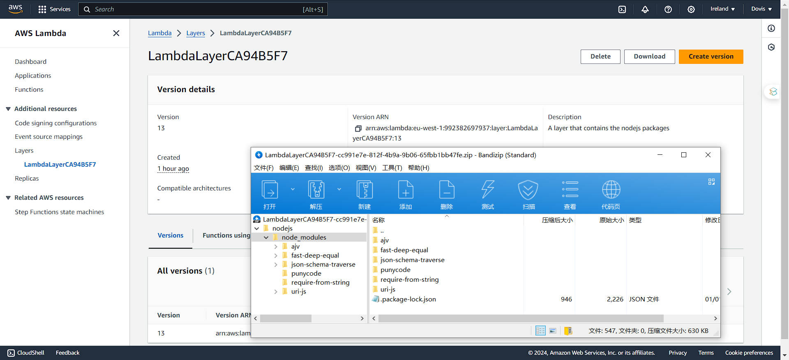

## Serverless REST Assignment.

__Name:__ Shijin Zhang

This repository contains an implementation of a serverless REST API for the AWS platform. The CDK framework is used to provision its infrastructure. The API's domain context is movie reviews.

`YouTube Video`:  https://youtu.be/RDPzmnQZmRk

### API endpoints.

**This is my finished App API endpoints (all of the endpoints displayed in specification):**

- POST /movies/reviews - add a movie review.
- GET /movies/{movieId}/reviews - Get all the reviews for the specified movie.
- GET /movies/{movieId}/reviews?minRating=n - Get the reviews for the specified movie with a rating greater than the minRating.
- GET /movies/{movieId}/reviews/{reviewerName} - Get the review written by the named reviewer for the specified movie.
- PUT /movies/{movieId}/reviews/{reviewerName} - Update the text of a review.
- GET /movies/{movieId}/reviews/{year} - Get the reviews written in a specific year for a specific movie.
- GET /reviews/{reviewerName} - Get all the reviews written by a specific reviewer.
- GET /reviews/{reviewerName}/{movieId}/translation?language=code - Get a translated version of a movie review using the movie ID and reviewer name as the identifier.

**Screenshots evidence from the AWS management console (API Gateway service):**

- POST /protected/movies/reviews 


- PUT /protected/movies/{movieId}/reviews/{reviewerName} 


- GET /public/movies/{movieId}/reviews 


- GET /public/movies/{movieId}/reviews?minRating=n 


- GET /public/movies/{movieId}/reviews/{reviewerName}


- GET /public/movies/{movieId}/reviews/{year} 


- GET /public/reviews/{reviewerName} 


- GET /public/reviews/{reviewerName}/{movieId}/translation?language=code 


### Authentication 

**Auth Api  - AWS management console (API Gateway service)**


**Auth Api  - AWS management console (Cognito User Pools)**

- SignUp:


- Confirm_Signup:


- SignIn:


- SignOut:


### Independent learning 

###### 1. Multi-stack app:

I have finished the infrastructure for multiple stacks - > [`AppApiStack`](https://github.com/Dovis01/Distributed-System-CA1/blob/main/lib/serverless-ca/app-api-stack.ts)  [`AuthApiStack`](https://github.com/Dovis01/Distributed-System-CA1/blob/main/lib/serverless-ca/auth-api-stack.ts)  [`InitConfigStack`](https://github.com/Dovis01/Distributed-System-CA1/blob/main/lib/serverless-ca/init-config-stack.ts)

This is the code examples in the file under Bin folder. You can access the file under the Bin folder : [`bin/serverless-ca.ts`](https://github.com/Dovis01/Distributed-System-CA1/blob/main/bin/serverless-ca.ts)

```typescript
#!/usr/bin/env node
import "source-map-support/register";
import * as cdk from "aws-cdk-lib";
import { InitConfigStack } from "../lib/serverless-ca/init-config-stack";
import {AuthApiStack} from "../lib/serverless-ca/auth-api-stack";
import {AppApiStack} from "../lib/serverless-ca/app-api-stack";

const app = new cdk.App();

const initConfigStack = new InitConfigStack(app, "InitConfigStack", { env: { region: "eu-west-1" } });

new AuthApiStack(app, 'AuthApiStack', {
    userPoolId: initConfigStack.userPool.userPoolId,
    userPoolClientId: initConfigStack.appClient.userPoolClientId,
    lambdaLayer: initConfigStack.lambdaLayer,
    env: { region: 'eu-west-1' },
});

new AppApiStack(app, 'AppApiStack', {
    userPoolId: initConfigStack.userPool.userPoolId,
    userPoolClientId: initConfigStack.appClient.userPoolClientId,
    lambdaLayer: initConfigStack.lambdaLayer,
    env: { region: 'eu-west-1' },
});
```

**Screenshots Evidence:**


###### 2. Lambda layers:

For the AWS application infrastructure, I also add the lambda layers to store the common node packages for all lambda functions.   Eg: `ajv` package

You can check the [`layers file`](https://github.com/Dovis01/Distributed-System-CA1/blob/main/layers/nodejs/package.json)to see the full content for common node packages stored in Lambda Layers.

**Lambda Layers file directory display :**


**The codes for the lambda layers configuration in** [`InitConfigStack file`](https://github.com/Dovis01/Distributed-System-CA1/blob/main/lib/serverless-ca/init-config-stack.ts) **and** [`bin/serverless-ca.ts`](https://github.com/Dovis01/Distributed-System-CA1/blob/main/bin/serverless-ca.ts):

```typescript
export class InitConfigStack extends cdk.Stack {
    public readonly lambdaLayer: lambda.LayerVersion;

    constructor(scope: Construct, id: string, props?: cdk.StackProps) {
        super(scope, id, props);

        // Add the Lambda layer
        this.lambdaLayer = new lambda.LayerVersion(this, 'LambdaLayer', {
            code: lambda.Code.fromAsset('layers'),
            compatibleRuntimes: [lambda.Runtime.NODEJS_16_X],
            description: 'A layer that contains the nodejs packages',
        });
    }
}


//  bin/serverless-ca.ts   pass construction parameter
const initConfigStack = new InitConfigStack(app, "InitConfigStack", { env: { region: "eu-west-1" } });

new AuthApiStack(app, 'AuthApiStack', {
    userPoolId: initConfigStack.userPool.userPoolId,
    userPoolClientId: initConfigStack.appClient.userPoolClientId,
    lambdaLayer: initConfigStack.lambdaLayer,
    env: { region: 'eu-west-1' },
});

new AppApiStack(app, 'AppApiStack', {
    userPoolId: initConfigStack.userPool.userPoolId,
    userPoolClientId: initConfigStack.appClient.userPoolClientId,
    lambdaLayer: initConfigStack.lambdaLayer,
    env: { region: 'eu-west-1' },
});
```

**AuthApiStack Code Example :**

You can see the full content -> [`AuthApiStack file`](https://github.com/Dovis01/Distributed-System-CA1/blob/main/lib/serverless-ca/auth-api-stack.ts) 

```typescript
private addAuthRoute(
        resourcePathName: string,
        method: string,
        fnName: string,
        fnEntryFileName: string
    ): void {
		
        const commonFnProps = {
            architecture: lambda.Architecture.ARM_64,
            timeout: cdk.Duration.seconds(10),
            memorySize: 128,
            runtime: lambda.Runtime.NODEJS_16_X,
            handler: "handler",
            //lambda function layers config
            layers: [this.lambdaLayer],
            bundling: {
                externalModules: [
                    "aws-sdk",
                    "ajv"
                ],
            },
            environment: {
                USER_POOL_ID: this.userPoolId,
                CLIENT_ID: this.userPoolClientId,
                REGION: cdk.Aws.REGION,
            },
        };
		
		// .......
    }
```

**AppApiStack Code Example :**

You can see the full content -> [`AppApiStack file`](https://github.com/Dovis01/Distributed-System-CA1/blob/main/lib/serverless-ca/app-api-stack.ts) 

```typescript
export class AppApiStack extends cdk.Stack {
    constructor(scope: Construct, id: string, props: AppApiProps) {
        super(scope, id, props);
		
        // .......
        
        const appCommonFnProps = {
            architecture: lambda.Architecture.ARM_64,
            timeout: cdk.Duration.seconds(10),
            memorySize: 128,
            runtime: lambda.Runtime.NODEJS_16_X,
            handler: "handler",
            //lambda function layers config
            layers: [props.lambdaLayer],
            bundling: {
                externalModules: [
                    "aws-sdk",
                    "ajv"
                ],
            },
            environment: {
                TABLE_NAME: movieReviewsTable.tableName,
                USER_POOL_ID: props.userPoolId,
                CLIENT_ID: props.userPoolClientId,
                REGION: cdk.Aws.REGION,
            },
        };
        
        // .......
        
    }
}
```

**Screenshots Evidence:**




###### 3. Review translations:

**Review Translation Relational Code Example :**

You can see the full content -> [`Review Translation Lambda function file`](https://github.com/Dovis01/Distributed-System-CA1/blob/main/lambdas/public/getSpecificReviewTranslation.ts) 

```typescript
import {TranslateClient, TranslateTextCommand} from "@aws-sdk/client-translate";

const dynamoDbDocClient = createDynamoDbDocClient();
const translateClient = new TranslateClient({region: process.env.REGION});

export const handler: APIGatewayProxyHandlerV2 = async (event, context) => {    
    try {
        console.log("Event: ", event);
        const language = event?.queryStringParameters?.language
        const parameters = event?.pathParameters;
        const movieId = parameters?.movieId ? parseInt(parameters.movieId) : undefined;
        const reviewerName = parameters?.reviewerName;

       // ......

        if(!language){
            return {
                statusCode: 404,
                headers: {
                    "content-type": "application/json",
                },
                body: JSON.stringify({Message: "Missing query string parameter for language."})
            };
        }

        const movieReviewCommandOutput = await dynamoDbDocClient.send(
            new GetCommand({
                TableName: process.env.TABLE_NAME,
                Key: {MovieId: movieId, ReviewerName: reviewerName},
            })
        );
		
        // ......
		
        // Translation core codes
        const contentToTranslate = [movieReviewCommandOutput.Item.ReviewerName, movieReviewCommandOutput.Item.Content];

        const translations = await Promise.all(contentToTranslate.map(text =>
            translateClient.send(new TranslateTextCommand({
                Text: text,
                SourceLanguageCode: 'auto',
                TargetLanguageCode: language,
            }))
        ));

        const translatedReview = {
            ...movieReviewCommandOutput.Item,
            ReviewerName: translations[0].TranslatedText,
            Content: translations[1].TranslatedText
        };

        // Return Response
        return {
            statusCode: 200,
            headers: {
                "content-type": "application/json",
            },
            body: JSON.stringify({
                message: "Get the translated version of a specific movie review successfully.",
                data: translatedReview,
            }),
        };

    } catch (error: any) {
        console.log(JSON.stringify(error));
        return {
            statusCode: 500,
            headers: {
                "content-type": "application/json",
            },
            body: JSON.stringify({error}),
        };
    }
};

// ......

```

**Add relational translation permission policies of lambda function config code in AppApiStack :**

```typescript
export class AppApiStack extends cdk.Stack {
    constructor(scope: Construct, id: string, props: AppApiProps) {
        super(scope, id, props);
        
        // ......
        
		// Add the translation and language detection permission policies
        const lambdaExecutionRole = new iam.Role(this, 'LambdaExecutionRole', {
            assumedBy: new iam.ServicePrincipal('lambda.amazonaws.com'),
            description: 'Role for Lambda that integrates with DetectDominantLanguage and Translate',
        });

        lambdaExecutionRole.addToPolicy(new iam.PolicyStatement({
            actions: ['translate:TranslateText'],
            resources: ['*'],
        }));

        lambdaExecutionRole.addToPolicy(new iam.PolicyStatement({
            actions: ['comprehend:DetectDominantLanguage'],
            resources: ['*'],
        }));

        // GET /reviews/{reviewerName}/{movieId}/translation?language=code
        const getSpecificReviewTranslationEndpoint = getReviewsByReviewerNameEndpoint.addResource("{movieId}").addResource("translation");
        const getSpecificReviewTranslationFn = new node.NodejsFunction(this, "GetSpecificReviewTranslationFn", {
            ...appCommonFnProps,
            entry: "./lambdas/public/getSpecificReviewTranslation.ts",
            role: lambdaExecutionRole,
        });
        getSpecificReviewTranslationEndpoint.addMethod("GET", new apig.LambdaIntegration(getSpecificReviewTranslationFn));
        movieReviewsTable.grantReadData(getSpecificReviewTranslationFn);
    }
}
```

**Screenshots Evidence:**

- Translated Version - Danish:


- Translated Version - China:


- Translated Version - China Taiwan:


- Translated Version - France:


